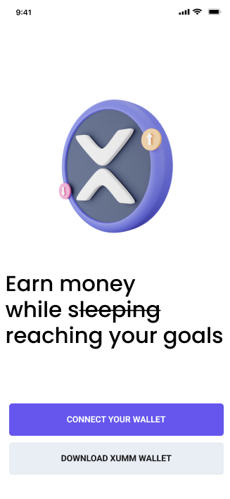
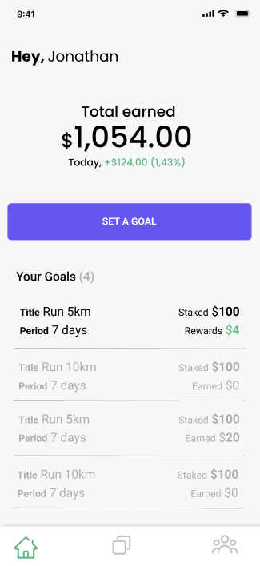
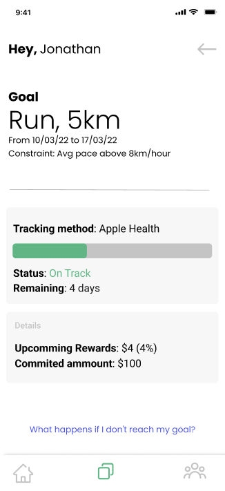

 
 

# PGZO, not so passive income.

> Earn money 
while ~~sleeping~~ reaching your goals

&nbsp;
&nbsp;

## SUMMARY

PGZO is a mobile dApp (decentralized app) where users can set fitness goals (initially, only running and walking will be released) and commit money towards those goals. 

The main objective of the app is to boost and encourage participants to fulfil their goals once they have "skin in the game" and they can also earn interests on their deposits.

&nbsp;
&nbsp;

## MAIN USE CASE

Let’s say "Alice" set a goal on PGZO (ie: Run 5km/day with a pace under 8km/hour.). If Alice is already using any normal tracking apps, we will get her historical information and check if she is setting an easy goal or not. 

This is important because PGZO aims to help its user’s to improve and push the limits, so there’s no reason to allow users set goals they already achieved. 

From the busines perspective, it’s also important to know if the goal meets some criteria, since PGZO gives back user’s initial deposits plus interests when they achieve their goals. This is a method to check if users are trying to trick the system setting goals too easy knowing already that they will be achievable.

As stated previously PGZO wants its users to fulfil their goals and become healthier, resilient, and committed. 

That's the main reason PGZO exists. To Help our users to improve!

Back to Alice’s example, after she had defined her goal, PGZO will calculate a minimum deposit (in crypto) to be delegated to PGZO.

Let’s say Alice’s deposit was 100 XRP. Then she defined a goal to run 5km/day with a average pace under 8km/hour. Alice now needs to define a period for her goal in days, weeks or months. Let's assume that she defined a week goal.

In summary, Alice's goal is to run 5km x 7days = 35km, respecting a average pace under 8km/hour. IF Alice fulfil her goal at the end of the period, she receives her initial deposit plus interests back (she can cash out of the PGZO back to her wallet or re-apply to a new goal).

If Alice partially meets her goal (We know, sometimes we fail, and that's okay, what matters is never give up.)  by more than 70%, she still have access to her initial deposit but no interests is rewarded. 

If she reaches less than 69% of her goal, her amount in stake for that specific goal remains locked until she reaches the same goal twice or it get's automatically unlocked after 30 days.

The "penalt" for a failed goal is simple. She needs to wait a superior time to unlock her assets and lose the boost in your interests proposed to the goal.

It's important to highlight that your asset reamains yours, ALWAYS! 

Alice can also define that if she meets her goal, a portion of her interests goes towards a beneficiary cause on a PGZO charity session (v2).

This also triggers the motivation to Alice fulfil her goals and generate interests to help people/causes other that herself.

She can also create accounts (personal) to contribute with her interests. I.e. Savings towards summer vacations (v2).

Alice can be healthier, stick with her goals, donate partially or totally her earned interests to a cause she supports.

All the interests generated are result of users' deposit providing liquidity on liquidity pools.

&nbsp;
&nbsp;
## ROADMAP

1.	Users will be able to create private or public group challenges and deposit crypto to serve as prizespools to rewards whom match some criteria defined by the community.
&nbsp;

2.	Brands and Users can create events, deposit crypto, and define partial proceeds to support charity causes.
&nbsp;

3.	Brands can mint NFTs to use as gifts to users achieving specific goals.
&nbsp;

4.	Users achieving her goals, will be able to earn NFTs which can allow them to get early access to promo or services offered by brands. ie: discount on a new runner band, etc.

